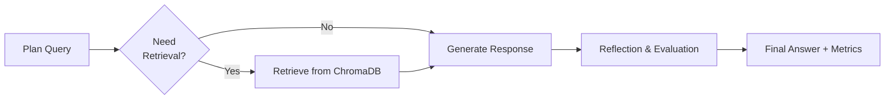

# 🌍 EcoRAG Agent

### Advanced Environmental AI Assistant with Multi-LLM RAG & Auto-Failover

[](https://huggingface.co/spaces/The-Arthur-Morgan/EcoRAG-Agent)
[](https://python.org)
[](https://langchain.com/langgraph)
[](LICENSE)
[](https://gradio.dev)

> 🌱 **Ask anything about climate change, renewable energy, or sustainability — and receive smart, evaluated answers from a resilient, multi-LLM RAG Agent.**

---

## 🚀 Live Demo

Try it now:
👉 **[EcoRAG Agent on Hugging Face Spaces](https://huggingface.co/spaces/The-Arthur-Morgan/EcoRAG-Agent)**


---

## 🔥 Key Features

### 🤖 **Resilient Multi-LLM Architecture**

* Dual LLM Backbone: **Groq (Llama 3.1)** + **Google Gemini (Gemini 2.5 Flash)**
* **6-Key Failover System**: 3 Groq + 3 Gemini keys with automatic health checks
* **Zero-Downtime Switching** if one provider fails

### 🧠 **Smart 4-Step RAG Workflow (LangGraph)**



---

## 🛠️ Installation

### ✅ Prerequisites

* Python **3.8+**
* At least **one** API key from:

  * [Groq](https://console.groq.com/)
  * [Google Gemini](https://aistudio.google.com/)

---

### ▶️ Local Setup

1. **Clone the Repository**

```bash
git clone https://github.com/itripathiharsh/EcoRAG-Agent.git
cd EcoRAG-Agent
```

2. **Install Dependencies**

```bash
pip install -r requirements.txt
```

3. **Configure Environment Variables**

```bash
cp .env.example .env
# Add your API keys inside .env
```

4. **Run the Application**

```bash
python app.py
```

---

### 🔑 Environment Variables

```env
# Required: At least one key (Groq or Gemini)
GROQ_API_KEY=your_groq_key

# Optional: Backup keys for failover
GROQ_API_KEY_2=backup_groq_key
GROQ_API_KEY_3=third_groq_key
```

---

## 📁 Project Structure

```
EcoRAG-Agent/
├── app.py                 # 🎯 Main Gradio interface
├── agent.py               # 🤖 LangGraph agent (multi-LLM logic)
├── knowledge_base.py      # 🧠 ChromaDB vector store + embeddings
├── status_dashboard.py    # 📊 System monitoring
├── requirements.txt       # 📦 Dependencies
├── assets/                # 🖼️ Screenshots & media
├── .gitignore
└── README.md
```

---

## 🔧 Core Components

### ✅ 1. Agent (`agent.py`)

* 4-node **LangGraph** workflow
* Automatic LLM switching & retry logic
* Response evaluation + relevance scoring

### 📚 2. Knowledge Base (`knowledge_base.py`)

* Local **ChromaDB** vector database
* **MiniLM-L6-v2** embeddings
* Sample curated environmental datasets

### 🧑‍💻 3. Web App (`app.py`)

* Built using **Gradio**
* User-friendly UI + live system status
* Mobile-responsive layout

---

## 💡 Usage Example

```python
from agent import QAAgent
from knowledge_base import KnowledgeBase

kb = KnowledgeBase()
agent = QAAgent(kb, groq_api_keys, gemini_api_keys)

result = agent.ask_question("What are the benefits of renewable energy?")
print("Answer:", result["answer"])
print("Relevant:", result["is_answer_relevant"])
```

---

## 📊 Performance

| Metric             | Result                       |
| ------------------ | ---------------------------- |
| Avg Response Time  | 2–4 sec                      |
| Retrieval Accuracy | Top-3 relevant documents     |
| Uptime             | 99%+ with auto-failover      |
| Scaling            | Horizontal scaling supported |

---

## 🌐 Deployment

### 🟨 Hugging Face Spaces

1. Fork to HF Spaces
2. Add API keys in **Settings → Repository Secrets**
3. App auto-deploys on push

### 🏠 Local Production

```bash
python app.py --host 0.0.0.0 --port 7860
```

### 🐳 Docker (Coming Soon)

```bash
docker build -t eco-rag-agent .
docker run -p 7860:7860 eco-rag-agent
```

---

## 🤝 Contributing

We welcome contributions to enhance EcoRAG!
Read the guidelines: **CONTRIBUTING.md** *(add this file if not present)*

```bash
# Create virtual environment
python -m venv venv
source venv/bin/activate   # Mac/Linux
venv\Scripts\activate      # Windows

# Install dev dependencies
pip install -r requirements.txt
```

---

## 📄 License

This project is licensed under the **MIT License** — see the [LICENSE](LICENSE) file.

---

## 🙏 Acknowledgments

* **LangGraph** – Agent workflow framework
* **ChromaDB** – Vector database
* **Groq + Gemini** – LLM providers
* **Gradio** – UI framework

---

## 📞 Support

| Channel     | Link                                                                                                                     |
| ----------- | ------------------------------------------------------------------------------------------------------------------------ |
| Issues      | [https://github.com/itripathiharsh/EcoRAG-Agent/issues](https://github.com/itripathiharsh/EcoRAG-Agent/issues)           |
| Discussions | [https://github.com/itripathiharsh/EcoRAG-Agent/discussions](https://github.com/itripathiharsh/EcoRAG-Agent/discussions) |
                                                                                             

---

<div align="center">

**Built with ❤️ for Environmental Awareness, Climate Education & AI Research**

[⬆ Back to Top](#-ecorag-agent)

</div>

---

