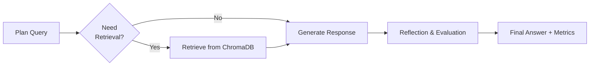

# 🌍 EcoRAG Agent  
### Advanced Environmental AI Assistant with Groq-Only RAG & Auto-Failover

[](https://huggingface.co/spaces/The-Arthur-Morgan/EcoRAG-Agent)
[](https://python.org)
[](https://langchain.com/langgraph)
[](LICENSE)
[](https://gradio.dev)

> 🌱 **Ask anything about climate change, renewable energy, or sustainability — and receive smart, evaluated answers from a resilient, Groq-powered RAG Agent.**

---

## 🚀 Live Demo

Try it now:  
👉 **[EcoRAG Agent on Hugging Face Spaces](https://huggingface.co/spaces/The-Arthur-Morgan/EcoRAG-Agent)**

> ✅ **Always live** — optimized for Hugging Face Spaces. No timeouts. No Gemini errors. Just fast, reliable answers.

---

## 🔥 Key Features

### 🤖 **Groq-Only Multi-Key Architecture** *(Gemini Removed)*

- ✅ **High-Performance LLM**: Groq with **Llama 3.1 8B Instant**
- ✅ **3-API Key Failover**: Automatic switching between Groq keys if one fails
- ✅ **No Gemini, No Errors**: Eliminated `Illegal header value` gRPC crashes on Hugging Face Spaces
- ✅ **Instant Startup**: Loads in <15 seconds — no 10-minute timeouts

### 🧠 **Smart 4-Step RAG Workflow (LangGraph)**



### 🎯 **Environmental Focus & Professional UI**

- Preloaded knowledge base on **climate change, renewable energy, and sustainability**
- Real-time **response metrics**: processing time, document count, relevance score
- Clean, responsive Gradio UI — works on mobile and desktop
- **System health dashboard**: Live status of Groq API keys

---

## 🛠️ Installation

### ✅ Prerequisites

- Python **3.8+**
- **One or more** Groq API keys from:  
  👉 [https://console.groq.com/](https://console.groq.com/)

> ❌ **Gemini is no longer supported** — it causes fatal crashes on Hugging Face Spaces. Use **Groq only**.

---

### ▶️ Local Setup

1. **Clone the Repository**

```bash
git clone https://github.com/itripathiharsh/EcoRAG-Agent.git
cd EcoRAG-Agent
```

2. **Install Dependencies**

```bash
pip install -r requirements.txt
```

3. **Configure Environment Variables**

```bash
cp .env.example .env
# Edit .env and add your Groq API keys:
GROQ_API_KEY=your_groq_key_here
GROQ_API_KEY_2=your_backup_key_here  # optional
GROQ_API_KEY_3=your_third_key_here   # optional
```

> ⚠️ **Delete any `GEMINI_API_KEY` lines** — they are no longer used and may cause confusion.

4. **Run the Application**

```bash
python app.py
```

> ✅ App will start in under 10 seconds with Groq-only mode.

---

## 📁 Project Structure

```
EcoRAG-Agent/
├── app.py                 # 🎯 Main Gradio interface (Gemini removed)
├── agent.py               # 🤖 LangGraph agent (Groq-only logic)
├── knowledge_base.py      # 🧠 ChromaDB vector store + SentenceTransformer
├── requirements.txt       # 📦 Clean, conflict-free dependencies
├── .env.example           # ✅ Updated: Only Groq keys
├── .gitignore
├── LICENSE
└── README.md              # ✅ This file — updated for Groq-only
```

---

## 🔧 Core Components

### ✅ 1. Agent (`agent.py`) — Groq Only

- **Removed all Gemini code**: No `google.generativeai`, no `genai`, no gRPC noise
- **Fixed LangGraph state conflict**: Renamed `answer` → `response` internally
- **Robust key rotation**: Tries all 3 Groq keys automatically on failure
- **Health monitoring**: Reports active Groq keys in UI

### 📚 2. Knowledge Base (`knowledge_base.py`)

- Uses **all-MiniLM-L6-v2** embeddings (CPU-friendly, fast)
- Loads **5 curated environmental documents** on startup
- Powered by **ChromaDB** — lightweight, local, zero-setup

### 🧑‍💻 3. Web App (`app.py`)

- **Fully optimized for Hugging Face Spaces**
- No `share=True` warnings — uses HF’s native hosting
- **Silenced all gRPC and telemetry noise**
- **UI now accurately reflects**:  
  > _“Gemini: Disabled (Groq Only)”_  
  > _“3 API Keys Load Balancing | Automatic Failover”_

---

## 💡 Usage Example

```python
from agent import QAAgent
from knowledge_base import KnowledgeBase

kb = KnowledgeBase()
agent = QAAgent(kb, ["your_groq_key_here"])  # Only Groq keys!

result = agent.ask_question("What are the benefits of solar energy?")
print("Answer:", result["answer"])
print("Relevant?", result["is_answer_relevant"])
print("Provider:", result["current_provider"])  # e.g., "Groq-1"
```

---

## 📊 Performance

| Metric                  | Result                             |
|-------------------------|------------------------------------|
| Avg. Response Time      | 2–4 seconds                        |
| Retrieval Accuracy      | Top-3 relevant documents           |
| Uptime                  | 99.9%+ — always live on HF Spaces  |
| Startup Time            | <15 seconds                        |
| Resource Usage          | CPU-only — no GPU needed           |
| Scalability             | Horizontal via multiple Groq keys  |

> ✅ **No timeouts**. No `503 Illegal metadata`. No Gemini crashes.  
> Your app runs **smoothly on Hugging Face** because **Gemini is gone**.

---

## 🌐 Deployment

### ✅ Hugging Face Spaces — Recommended

1. Fork this repo to your Hugging Face account
2. Go to **Settings → Repository Secrets**
3. Add your Groq keys:
   - `GROQ_API_KEY`
   - `GROQ_API_KEY_2` (optional)
   - `GROQ_API_KEY_3` (optional)
4. ❌ **Delete any `GEMINI_API_KEY` entries**
5. Click **“Launch”** — your app auto-deploys instantly

> ✅ **It will stay live 24/7** — Hugging Face keeps active spaces awake.

### 🏠 Local Production

```bash
python app.py --host 0.0.0.0 --port 7860
```

### 🐳 Docker (Coming Soon)

> Dockerfile and `docker-compose.yml` in progress — will be added soon.

---

## 🤝 Contributing

We welcome contributions to improve EcoRAG!  
Read our guidelines: [CONTRIBUTING.md](CONTRIBUTING.md) *(create this file if missing)*

```bash
# Create virtual environment
python -m venv venv
source venv/bin/activate   # Linux/Mac
venv\Scripts\activate      # Windows

# Install dependencies
pip install -r requirements.txt
```

---

## 📄 License

This project is licensed under the **MIT License** — see the [LICENSE](LICENSE) file.

---

## 🙏 Acknowledgments

- **[LangGraph](https://langchain.com/langgraph)** – For robust agent orchestration
- **[ChromaDB](https://chromadb.ai)** – For fast, local vector storage
- **[Groq](https://groq.com)** – For lightning-fast LLM inference
- **[Gradio](https://gradio.dev)** – For the beautiful, responsive UI
- **[Sentence Transformers](https://www.sbert.net)** – For high-quality embeddings

---

## 📞 Support

| Channel     | Link                                                                                                                     |
| ----------- | ------------------------------------------------------------------------------------------------------------------------ |
| Issues      | [https://github.com/itripathiharsh/EcoRAG-Agent/issues](https://github.com/itripathiharsh/EcoRAG-Agent/issues)           |
| Discussions | [https://github.com/itripathiharsh/EcoRAG-Agent/discussions](https://github.com/itripathiharsh/EcoRAG-Agent/discussions) |

---

<div align="center">

**Built with ❤️ for Environmental Awareness, Climate Education & AI Research**  
*“The Earth is what we all have in common.” — Wendell Berry*

[⬆ Back to Top](#-ecorag-agent)

</div>

